# Azure OpenAI Realtime iOS Sample

[](https://swift.org)
[](https://developer.apple.com/ios/)
[](LICENSE)

A sample iOS app demonstrating real-time voice conversations with Azure OpenAI's GPT-4o Realtime API using WebRTC.

<p align="center">
  
  &nbsp;&nbsp;&nbsp;&nbsp;
  
</p>

## Features

- 🎤 **Real-time voice conversations** with GPT-4o
- 📝 **Live transcription** of both user and assistant speech
- 🔧 **Tool calling** — model can call functions (time, weather, device info) during conversation
- 💾 **Conversation history** persisted with SwiftData
- 🔊 **Multiple voice options** (Alloy, Echo, Shimmer, etc.)
- 📤 **Share transcripts** via iOS share sheet

## Quick Start

### Prerequisites

- macOS 14.0+ with Xcode 16.0+
- Python 3.11+
- Azure subscription with [Azure OpenAI access](https://learn.microsoft.com/azure/ai-services/openai/overview)

### 1. Clone and Configure Backend

```bash
git clone https://github.com/YOUR_USERNAME/realtime-api.git
cd realtime-api/backend

# Setup Python environment
python3 -m venv .venv && source .venv/bin/activate
pip install -e .

# Configure Azure credentials
cp .env.example .env
# Edit .env with your Azure OpenAI credentials
```

### 2. Start the Token Service

```bash
uvicorn main:app --reload
```

Verify it's running: `curl http://localhost:8000/health`

### 3. Run the iOS App

1. Open `realtime-api.xcodeproj` in Xcode
2. Select your development team (Signing & Capabilities)
3. Run on Simulator (⌘R)

For detailed setup instructions, see [Getting Started Guide](docs/GETTING_STARTED.md).

## Architecture

```mermaid
graph TB
    subgraph iOS["iOS App"]
        Views["SwiftUI Views"]
        VM["ViewModel"]
        DB["SwiftData"]
        RTC["RealtimeAPI<br/>(WebRTC)"]
        Views <--> VM
        VM <--> DB
        VM --> RTC
    end
    
    subgraph Backend["Token Backend<br/>(Authentication Relay)"]
        FastAPI["FastAPI Service<br/>/api/v1/token"]
    end
    
    subgraph Azure["Azure OpenAI"]
        TokenAPI["/realtime/sessions<br/>(Token Endpoint)"]
        RealtimeAPI["Realtime API<br/>(gpt-realtime-mini)"]
    end
    
    RTC -->|"① Request Token<br/>(HTTPS)"| FastAPI
    FastAPI -->|"② Authenticate & Request<br/>(HTTPS)"| TokenAPI
    TokenAPI -.->|"③ Return Ephemeral Token"| FastAPI
    FastAPI -.->|"④ Return Token"| RTC
    RTC ==>|"⑤ Direct WebRTC Connection<br/>(with token)<br/>Bidirectional Audio"| RealtimeAPI
```



**Connection Flow:**

1. **iOS App** requests ephemeral token from Token Backend (HTTPS)
2. **Token Backend** authenticates with Azure OpenAI API (HTTPS)
3. **Azure** returns ephemeral token to Token Backend
4. **Token Backend** forwards token to iOS App
5. **iOS App** establishes direct WebRTC connection to Azure Realtime API using token
6. Audio streams bidirectionally between iOS and Azure (Token Backend not in audio path)

**Key Components:**

| Component | Technology | Purpose |
|-----------|------------|---------|
| iOS App | SwiftUI, SwiftData | Voice conversation UI |
| ViewModel | Swift, async/await | Business logic, API integration |
| RealtimeAPI | WebRTC | Real-time audio streaming |
| Token Backend | Python, FastAPI | Secure token generation |

## Project Structure

```
realtime-api/
├── realtime-api/              # iOS app source
│   ├── Models/                # SwiftData entities
│   ├── ViewModels/            # Business logic
│   ├── Views/                 # SwiftUI views
│   ├── Services/              # API clients
│   └── Tools/                 # Function calling tools
│       ├── ToolRegistry.swift # Tool protocol & registry
│       ├── GetCurrentTimeTool.swift
│       ├── GetWeatherTool.swift
│       └── GetDeviceInfoTool.swift
├── backend/                   # Python token service
│   ├── main.py               # FastAPI app
│   └── .env.example          # Environment template
└── docs/                      # Documentation
    └── GETTING_STARTED.md    # Setup guide
```

## Tool Calling

The app supports real-time function calling — the AI model can invoke tools during voice conversations. Tools are registered via `session.update` after the WebRTC session is established.

### Built-in Tools

| Tool | Description |
|------|-------------|
| `get_current_time` | Returns current date/time in user's timezone |
| `get_weather` | Returns weather for a location (simulated data) |
| `get_device_info` | Returns device model, OS version, battery level |

### Adding Custom Tools

1. Create a struct conforming to `CallableTool`:

```swift
struct MyTool: CallableTool {
    let name = "my_tool"
    let description = "Does something useful"
    let parameters: JSONSchema = .object(properties: [
        "input": .string(description: "The input value")
    ])

    func execute(arguments: String) async -> String {
        // Parse arguments JSON, do work, return result JSON
        return "{\"result\": \"done\"}"
    }
}
```

2. Add it to `ToolRegistry.swift`'s default tools array.

Tool calls appear as subtle status messages in the conversation UI and are not persisted to conversation history.

## Configuration

### Backend Environment Variables

| Variable | Description |
|----------|-------------|
| `AZURE_OPENAI_ENDPOINT` | Your Azure OpenAI resource URL |
| `AZURE_OPENAI_API_KEY` | API key from Azure Portal |
| `AZURE_OPENAI_DEPLOYMENT` | Deployment name (e.g., `gpt-realtime-mini`) |
| `AZURE_OPENAI_TRANSCRIPTION_MODEL` | Transcription model (default: `gpt-4o-mini-transcribe`) |

### iOS Configuration

The app automatically connects to `http://127.0.0.1:8000` on Simulator. For physical devices, set `BACKEND_URL` in the Xcode scheme environment variables.

## Contributing

1. Fork the repository
2. Create a feature branch (`git checkout -b feature/amazing-feature`)
3. Commit your changes (`git commit -m 'Add amazing feature'`)
4. Push to the branch (`git push origin feature/amazing-feature`)
5. Open a Pull Request

## Resources

- [Azure OpenAI Realtime API Documentation](https://learn.microsoft.com/azure/ai-services/openai/realtime-audio-quickstart)
- [swift-realtime-openai Package](backend/swift-realtime-openai/README.md)
- [SwiftUI Documentation](https://developer.apple.com/documentation/swiftui)

## License

This project is licensed under the MIT License - see the [LICENSE](LICENSE) file for details.
